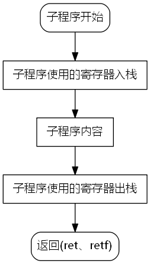

<!-- @import "[TOC]" {cmd="toc" depthFrom=1 depthTo=6 orderedList=false} -->

<!-- code_chunk_output -->

* [call和ret指令](#call和ret指令)
	* [检测点10-1](#检测点10-1)
	* [检测点10-2](#检测点10-2)
	* [检测点10-3](#检测点10-3)
	* [检测点10-4](#检测点10-4)
	* [检测点10-5](#检测点10-5)
		* [10-5-1](#10-5-1)
		* [10-5-2](#10-5-2)
	* [10-9模块化程序设计](#10-9模块化程序设计)
	* [10-10参数和结果传递](#10-10参数和结果传递)
	* [10-11批量数据的传递](#10-11批量数据的传递)
	* [10-12寄存器冲突的问题](#10-12寄存器冲突的问题)
	* [实验十 编写子程序](#实验十-编写子程序)
		* [显示字符串](#显示字符串)
		* [解决除法溢出的问题](#解决除法溢出的问题)
		* [数值显示](#数值显示)
	* [课程设计](#课程设计)

<!-- /code_chunk_output -->


# call和ret指令

|指令|意义|等效代码|
|:---:|:---|:---:|
|`ret`|用栈中的数据修改`ip`的内容<br>近转移|`pop ip`|
|`retf`|用栈中的数据修改`cs`和`ip`的内容<br>远转移|`pop ip`<br>`pop cs`|
|`call`|1.将当前的`ip`或`cs`和`ip`压入栈中<br>2.转移<br>不能实现短转移<br>`call`指令实现转移的原理和`jmp`指令相同|  |
|`call 标号`|将当前的`ip`压栈，转到标号处执行指令|`push ip`<br>`jmp near ptr 标号`|
|`call far ptr 标号`|段间转移<br>之前的`call`对应的机器码中是相对位移|`push cs`<br>`push ip`<br>`jmp far ptr 标号`|
|`call 16位reg`|  |`push ip`<br>`jmp 16位reg`|
|`call word ptr 内存单元地址`|  |`push ip`<br>`jmp word ptr 内存单元地址`|
|`call dword ptr 内存单元地址`|内存单元开始处放着两个字<br>高地址是转移的目的段地址<br>低地址是转移的目的偏移地址|`push cs`<br>`push ip`<br>`jmp dword ptr 内存单元地址`|
|`call`和`ret`配合使用|可以写一个具有一定功能的程序段,称其为子程序<br>在需要的时候,用`call`去执行<br>用`ret`指令转到`call`指令后面的代码处继续执行|  |
|`mul reg`<br>`mul 内存单元`|两个乘数都是8位或16位<br>8位:`ax`=`al`\*(8位`reg`或内存字节单元)<br>16位:(`dx`高,`ax`低)=`ax`\*(16位`reg`或内存字单元)|  |

## 检测点10-1

```asm
;补全程序，实现从内存1000:0000处开始执行指令
assume cs:code
stack segment
    db 16 dup (0)
stack ends
code segment
start:
    mov ax,stack
    mov ss ,ax
    mov sp,16
    mov ax,1000     ;ans
    push ax
    mov ax,0h       ;ans
    push ax
    retf
code ends
end start
```

## 检测点10-2

下面的程序执行后,`ax`中的数值为多少

|内存地址|机器码|汇编指令|分析|
|:---:|:---|:---|:---|
|1000:0|b8 00 00|`mov ax,0`|  |
|1000:3|e8 01 00|`call s`|`push 6`<br>`jmp near s`|
|1000:6|40|`inc ax`|  |
|1000:7|58|`s:pop ax`|`ax=6`|

答案为：6

## 检测点10-3

下面的程序执行后,`ax`中的数值为多少

|内存地址|机器码|汇编指令|分析|
|:---:|:---|:---|:---|
|1000:0|b8 00 00|`mov ax,0`||
|1000:3|9a 09 00 00 10|`call far ptr s`|`push cs(1000)`<br>`push ip(8)`<br>`jmp far s`|
|1000:8|40|`inc ax`||
|1000:9|58|`s:pop ax`<br>`add ax,ax`<br>`pop bx`<br>`add ax,bx`|`ax=8`<br>`ax=10h`<br>`bx=1000h`<br>`ax=1010h`|

答：`ax`中的数值为1010h

## 检测点10-4

下面的程序执行后,`ax`中的数值为多少

|内存地址|机器码|汇编指令|分析|
|:---:|:---|:---|:---|
|1000:0|b8 06 00|`mov ax,6`||
|1000:3|ff d0|`call ax`|`push 5`<br>`jmp ax(6)`|
|1000:5|40|`inc ax`||
|1000:6||`mov bp,sp`<br>`add ax,[bp]`|`bp=sp`<br>`ax+=5`|

答：`ax`中的数值为11

## 检测点10-5

### 10-5-1

下面的程序执行后，`ax`为多少

```asm
assume cs:code
stack segment
    dw 8 dup (0)
stack ends
code segment
start:
    mov ax,stack    ;0000
    mov ss,ax       ;0003
    mov sp,16       ;0005
    mov ds,ax       ;0008
    mov ax,0        ;000a
    call word ptr ds:[0EH]  ;000d;sp=14=0e,ss:[sp]=sp:[000e]=0011,call [000e]
    inc ax          ;0011
    inc ax
    inc ax
    mov ax,4c00h
    int 21h
code ends
end start
```
答：`ax`=3

### 10-5-2

下面程序执行后，`ax`和`bx`中的数值是多少

```asm
assume cs:code
data segment
    dw 8 dup (0)
data segment

code segment
start:
    mov ax,data
    mov ss,ax
    mov sp,16
    mov word ptr ss:[0],offset s    ;ss:[0]=offset s
    mov ss:[2],cs                   ;ss:[2]=cs
    call dword ptr ss:[0]           ;push cs(0e-0f),push ip(0c-0d),jmp dword s
    nop
s:
    mov ax,offset s                 ;ax=offset s
    sub ax,ss:[0ch]                 ;ax=1
    mov bx,cs                       ;bx=cs
    sub bx,ss:[0eh]                 ;bx=0

    mov ax,4c00h
    int 21h
```

答：`ax`为1，`bx`为0

## 10-9模块化程序设计

利用`call`和`ret`，可以用简便的方法，实现多个相互联系、功能独立的子程序来解决一个复杂的问题。

## 10-10参数和结果传递

子程序一般都需要根据提供的参数处理一定的事务，处理后，将结果(返回值)提供给调用者。其实，我们讨论参数和返回值传递的问题，实际上就是在讨论，应该如何存储子程序需要的参数和产生的返回值。

用寄存器来存储参数和结果是最常使用的方法。对于存放参数的寄存器和存放结果的寄存器，调用者和子程序的读写结果恰恰相反;调用者将参数送入参数寄存器，从结果寄存器中取到返回值；子程序从参数寄存器中去导致，将结果送入结果寄存器。

```asm
;计算data段中第一组数据的3次方，结果保存在后面一组dword单元中
assume cs:code
data segment
    dw 1,2,3,4,5,6,7,8
    dd 0,0,0,0,0,0,0,0
data ends

code segment
start:
    mov ax,data
    mov ds,ax
    mov si,0        ;ds:si 指向第一组word单元
    mov di,16        ;ds:di 指向第二组dword单元
    mov cx,8
s:  mov bx,[si]
    call cube
    mov [di],ax
    mov [di].2,dx
    add si,2        ;ds:si 指向下一个word单元
    add di,4        ;ds:di 指向下一个dword单元
    loop s

    mov ax,4c00h
    int 21h
cube:
    mov ax,bx
    mul bx
    mul bx
    ret
code ends
end start
```

## 10-11批量数据的传递

由于寄存器的数量有限，我们不能简单地用寄存器来存放多个需要传递的数据。我们将批量数据放到内存中，然后将它们所在内存空间的首地址放在寄存器中，传递给需要的子程序。返回也用同样的方法。

```asm
;将data段中的字符串大写
assume cs:code
data segment
    db 'conversation'
data ends

code segment
start:
    mov ax,data
    mov ds,ax
    mov si,0        ;首地址
    mov cx,12       ;长度
    call capital
    mov ax,4c00h
    int 21h
capital:
    and byte ptr [si],11011111b
    inc si
    loop capital
    ret
code ends
end start
```

## 10-12寄存器冲突的问题

在子程序的开始将子程序中所有用到的寄存器中的内容都保存起来。在子程序返回前再恢复。可以用栈来保存寄存器中的内容。



## 实验十 编写子程序

### 显示字符串

### 解决除法溢出的问题

### 数值显示

## 课程设计