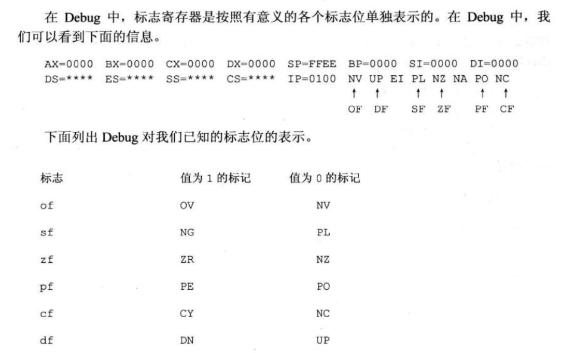

<!-- @import "[TOC]" {cmd="toc" depthFrom=1 depthTo=6 orderedList=false} -->

<!-- code_chunk_output -->

* [标志寄存器](#标志寄存器)
* [相关指令](#相关指令)
* [例子1](#例子1)
* [例子2](#例子2)
* [cmp 总结](#cmp-总结)
	* [cmp进行无符号数比较](#cmp进行无符号数比较)
	* [cmp进行有符号数比较](#cmp进行有符号数比较)
* [检测比较结果的条件转移指令](#检测比较结果的条件转移指令)
* [标志寄存器在debug中](#标志寄存器在debug中)

<!-- /code_chunk_output -->

相关标志位：`zf`、`pf`、`sf`、`cf`、`of`、`df`

相关指令：`adc`、`sbb`、`cmp`、`movesp`、`rep`、`cld`、`std`、`pushf`、`popf`


# 标志寄存器

标志寄存器(简称`flag`)（其中存储的信息通常被称为程序状态字`PSW`）的作用：
1. 用来存储相关指令的某些执行结果
2. 用来为cpu执行相关指令提供行为依据
3. 用来控制CPU的相关工作方式

`flag`寄存器按位起作用，每一位都有专门的含义。


|标志|功能|
|:---:|:---|
|`zf`|零标志位<br>记录相关指令执行后，其结果是否为0<br>相关指令结果为0，`zf`=1<br>相关指令结果为1，`zf`=0<br>`add`、`sub`、`mul`、`div`、`inc`、`or`、`and`|
|`pf`|奇偶标志位<br>记录相关指令执行后，其结果的所有bit位中1的个数是否为偶数<br>如果1的个数为偶数，`pf`=1|
|`sf`|符号标志位<br>记录相关指令执行后，其结果是否为负<br>相关指令为负，`sf=1`<br>将数据当作有符号数来计算的时候，可以通过它来得到结果的正负<br>将数据当作无符号数来计算的时候，虽然会影响`sf`的值但此时，`sf`的值没意义|
|`cf`|进位标志<br>记录了运算结果的最高有效位向更高有效位的进位值，或从更高位的借位值|
|`of`|溢出标志<br>针对有符号数而言<br>`cf`是对无符号数运算有意义的标志位<br>`of`是有符号数运算有意义的标志位<br>`sf`记录结果的符号<br>`mov al,98`<br>`add al,99`<br>cf=0,of=1|
|`df`|方向标志位<br>在串处理指令中，控制每次操作后`si`、`di`的增减<br>`df=0`:每次操作后 `si` 、 `di` 递增<br>每次操作后`si`、`di`递增|


# 相关指令

|指令|功能|例子|
|:---:|:---|:---|
|`adc`|带进位加法指令<br>利用了`cf`位上记录的进位值<br>指令格式：`abc obj1,obj2`<br>功能：`obj1=obj1+obj2+cf`<br>此处`cf`的值是`adc`前面的指令决定的<br>通过`adc`指令，我们可以对任意大的数据进行加法计算<br>[例子1](#例子1)<br>`inc`和`loop`不影响cf位|`add al,bl`<br>`adc ah,bh`<br>等同于`add ax,bx`|
|`sbb`|带借位减法指令<br>利用了`cf`位上记录的借位值<br>指令格式：`sbb obj1,obj2`<br>功能：`obj1=(obj1-obj2-cf)`<br>利用`obb`对任意大的数据进行减法运算|[例子2](#例子2)|
|`cmp`|比较指令<br>相当减法指令，只是不保存结果<br>执行后，将对标志寄存器产生影响<br>其他指令通过识别这些被影响的标志寄存器得知比较结果<br>指令格式：`cmp obj1,obj2`<br>功能：计算`obj1-obj2`,并不保存结果，仅影响`flag`相关位<br>具体情况见下|`cmp ax,ax`<br>`zf=pf=1`<br>`sf=cf=of=0`|
|`movsb`|执行`movsb`指令相当于将`ds:si`指向的内存单元中的字节送入`es:di`中，然后根据标志寄存器，将`si`和`di`递增或递减<br>`movsw`,传送一个字，`di`和`si`递增或递减2| |
|`rep`|根据`cx`的值，重复执行后面的串传送指令<br>`rep movsb`<br>`rep movsw`||
|`cld`|将`df`置0||
|`std`|将`df`置1||
|`pushf`<br>`popf`|pushf将标志寄存器的值压栈<br>popf将栈中弹出数据送入标志寄存器<br>为直接访问标志寄存器提供了一种方法| |

# 例子1

计算1ef0001000h+2010001ef0h，结果放在ax，bx，cx中

```asm
mov ax,001eh
mov bx,0f000h
mov cx,1000h
adc cx,1ef0h
adc bx,1000h
abc ax,0020h
```

# 例子2

计算003e1000h-00202000h:

```asm
mov bx,1000h
mov ax,003e
sub bx,2000h
sbb ax,0020
```

# cmp 总结

## cmp进行无符号数比较


## cmp进行有符号数比较

|情况|分析|
|:---:|:---|
|`sf=1`<br>`of`=0|of=0:没有溢出,逻辑上的正负就是实际的正负<br>sf=1:实际结果为负，所以ah<bh|
|`sf=1`<br>`of=1`|of=0：有溢出，sf=1：实际结果为负<br>ah>bh|
|`sf=0`<br>`of=1`|ah<bh|
|`sf=0`<br>of=0|ah>=hb|

# 检测比较结果的条件转移指令

因为cmp指令可以同时进行无符号数和有符号数的比较，所以根据cmp比较的结果转移的指令也分为两种。根据无符号数的比较结果转移的条件转移指令（它们检测zf、cf）。根据有符号数的比较结果进行转移的条件转移指令（它们检测sf、of和zf的值）。

|根据|指令|含义|检测的相关标志|
|:---:|:---:|:---|:---|
|无符号数|je|等于则转移|zf=1|
|无符号数|jne|不等于则转移|zf=0|
|无符号数|jb|低于则转移|cf=1|
|无符号数|jnb|不低于则转移|cf=0|
|无符号数|ja|高于则转移|cf=0 and zf=0|
|无符号数|jna|不高于则转移|cf=1 or zf1|

# 标志寄存器在debug中

