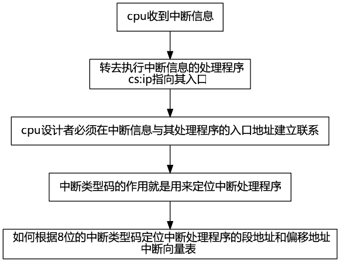
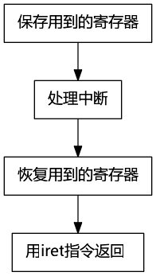

<!-- @import "[TOC]" {cmd="toc" depthFrom=1 depthTo=6 orderedList=false} -->

<!-- code_chunk_output -->

* [内中断](#内中断)
	* [1. 内中断的产生](#1-内中断的产生)
	* [2. 中断处理程序](#2-中断处理程序)
	* [3. 中断向量表](#3-中断向量表)
	* [4. 中断过程](#4-中断过程)
	* [5. 中断处理程序和iret指令](#5-中断处理程序和iret指令)
	* [6. 除法错误中断的处理](#6-除法错误中断的处理)

<!-- /code_chunk_output -->

相关指令: [iret](#5-中断处理程序和iret指令)

#　内中断

通用cpu可以在执行完当前执行的指令之后，检测到从cpu外部发送过来的或内部产生的一种特殊信息，并且可以立即对所接收到的信息进行处理。这种信息叫**中断信息**。中断的信息是指，cpu不再接着向下执行，而去处理这个特殊信息。

**中断信息**是要求cpu马上进行某种处理，并向所要进行的该种处理提供了必备的参数的通知信息。

cpu的中断可以来自内部或外部。

## 1. 内中断的产生

中断源(中断信息的来源)有：

|中断源|中断类型码|
|:---|:---:|
|除法错误，比如div指令产生的除法溢出|0|
|单步执行|1|
|执行`into`指令|4|
|执行`int`指令|该指令的格式为`int n`<br>指令中的`n`为字节型立即数<br>n为立即码|

## 2. 中断处理程序



## 3. 中断向量表

**中断类型码**通过**中断向量表**找到对应的**中断处理程序**的入口地址。

**中断向量表**就是**中断向量**的列表。

**中断向量**就是**中断处理程序**入口地址的。

**中断向量表**在内存中保存，其中存放着256个**中断源**所对应的中断处理程序的入口。

8086中**中断向量表**制定放在内存地址`0`处。从`0000:0000`到`0000:03ff`的`1024`个内存单元中存放着中断向量表。一个表项占两个字，高地址存`段地址`，低地址存`偏移地址`。

## 4. 中断过程

|中断过程|简洁描述|
|:---|:---|
|从中断信息中取得中断类型码|取得中断类型码`N`|
|标志寄存器的值入栈<br>(中断过程中会改变标志寄存器的值)|`pushf`|
|设置标志寄存器的第8位`tf`和第9位`if`的值为0|`TF=0`<br>`IF=0`|
|`cs`的内容入栈<br>`ip`的内容入栈|`push cs`<br>`push ip`|
|从中断向量表中读取中断处理程序的`ip`和`cs`|`(ip)=(N*4)`<br>`(cs)=(N*4+2)`|


## 5. 中断处理程序和iret指令

中断程序的编写方法:


`iret`指令等于`pop IP`;`pop CS`;`popf`，通常和硬件自动完成的中断过程配合使用。

## 6. 除法错误中断的处理

```asm
mov ax,1000h
mov bh,1
div bh
```